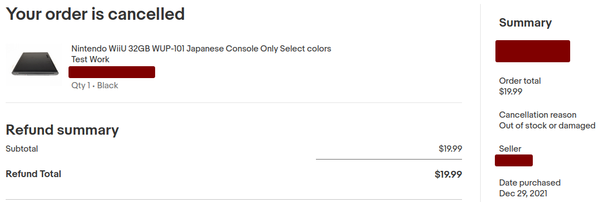
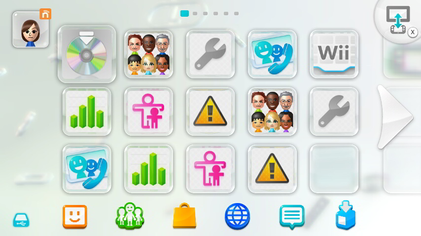
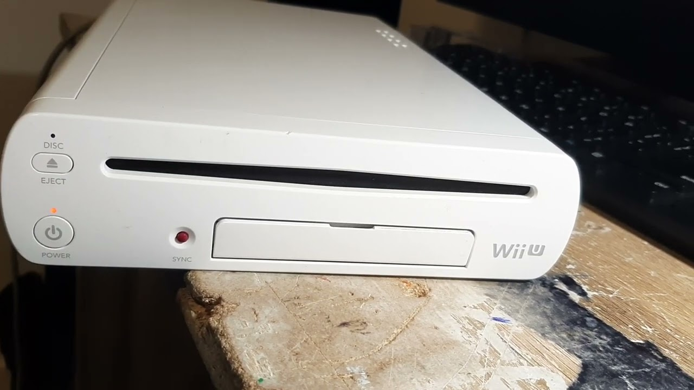

### Lets begin with how it started.

Back in December of 2021 (an entire year before I wrote this) I had purchased two Japanese Wii U’s, Console Only.

One of them was a black console, which got refunded by the seller because I guess it had already been sold elsewhere.  

The other console was a White Console, listed as 32GB but it was an 8GB (this has nothing to do with anything really, or it might, not enough info to make a good guess).  
The white console worked fine and I was able to get to the Wii U Menu and install Tiramisu on it.  
Oh yeah, while the console was in the mail a Custom Firmware called Tiramisu released, replacing Haxchi and Mocha (and now Aroma is public, replacing Tiramisu in a way. Lmao).

Tiramisu actually let me use the console a little bit more after everything! 
It let me boot vWii! 
Too bad there arent any exploits in vWii that can take over the Wii U Side!

Anyway, after all that I was looking into region changing the console. 
You cannot just simply install a different region Wii U Menu, as it will freeze. 
I did that, but you were able to use Bluubomb to fix whatever mistake you made. 
You could also use it to screw it up even more, which was what I did. 

### Lazr likes to brick

I wanted to see what happens if you deleted the original menu and tried to boot the out-of region menu. 
Of course it didn’t work but I made a grave mistake trying to fix it. 

I tried to go back to the original menu, but since I deleted it beforehand there was no way to boot, effectively bricking the console. 
It’s worth noting that at this point UDPIH didn't exist.

So.. What now? Why, I took it apart and restored the NAND of course (using an RPi0! My teensy died somehow). 
Took me an entire week but I did i- oh what the hell, 160-0103 now?

Yeah this console was one of those that had a bug in the eMMC chip.

I could not fix it so I gave up trying anything. 
That is the end of Japanese Wii U Era. 
It is now being used to create a modchip to glitch boot0.

### After the Japanese Wii U

A few months passed, not much was happening in the world of exploits...and then Gary pulls out UDPIH in June. I will note now that I had done the NAND restore on the Japanese Wii U in February.

I did not immediately start researching region changing again after the release. In fact I fixed one of the other broken consoles I had (and then 7 days after UDPIH released I got region changing figured out kekw). 
This console will be my guinea pig for region changing. 
It’s a US console but that was the least of my worries.

### Lets get into specifics!

Now that we’re actually getting into how I figured it out, let's talk about how regions are defined in the first place. 
In the NAND, specifically the SLC, there is a file called `sys_prod.xml` in `slc:/sys/config`. 
Inside of it there are values that define different things the system uses, but the two we want to look at are `game_region` and `product_area`

You can change one of the values and still boot, the other one not so much. 
`product_area` is the one you cannot change.. Or can you? 
Eventually I figured out that if you format the console, it's fair game and you can change this to your heart's content (within reason). 
Now with this change, let's try to change the region!...How do I do that?

At first I tried installing the titles manually, which did not work. 
Mii Maker in specific would give me error 199-9999 trying to boot it in initial setup. 

Okay so manually installing titles didn’t work.. 
Could you get the system to do it? 

Yes you can!

### Updates are broken

Take a look at System Settings. 
Yeah its a settings app, but it has something special in it that will help us: Updating the System. 

Our goal is to change the region, and that means using the titles from a different region. 

Oh by the way, the value of `product_area` also defines what region system titles to download! 

“So it's fair game now?” you may ask, and the answer is No. 

### Issues! Yay!

Issue #1:  
Booting it when you are formatted; since you are on initial setup, you can't launch System Settings yet. 

This is where “coldboothax” comes in. 

There's another `.xml` file in the same directory as `sys_prod.xml`. 
This file is called `system.xml`. 

In this file, there are values that tell boot1 what OS to use and the… boot title! 

  
(Please ignore the fact I have System Config Tool as my autoboot title. I took this image with my kiosk system.xml.)

You can set that value to System Settings and boot into it with no issues!

Issue #2:  
After installing the system update you will get into the other regions system menu, but you cannot complete the initial setup because the game_region is set for the original regions titles.  
What I did is set it to 119 for region free (because I do this alot) but you could just set it to the target region's value. 

Issue #3:  
The brick risk (i'll get into more detail later)  
The fix is having enough courage to go through with region changing.

*Now* it's fair game.
Letting it run a System Update will download the target regions titles and install them.

### Duplicate Titles

So all that is said and done, and there's one last issue but it's not as major: Duplicate System Titles. 

Since both original region and current region titles are installed, there are two titles of each. 

This is simply fixed by deleting them with FTPiiU Everywhere and rebooting to flush the cache. 
After everything is all said and done, you will have changed regions of the console! Congrats!

### Drawbacks

Yep, everything has one of these.  
The first one that comes to mind is you cannot access the Nintendo eShop.
I think it has something to do with titles linked to that console but after doing a system transfer and then region changing, I doubt it. 

The next one is the brick risk. It is very easy to brick doing this. I have two bricked consoles sitting in my room after editing system.xml manually. This is also why I opted to use a modified recovery_menu in the guide.

(Hyperlink to a YouTube video.)

This next issue has happened on two of my consoles now (because I didnt know until recently).
It will always get to the end and spit out error code `162-3002`
This happens if you cleaned the system tickets (not application tickets).
Don't clear your tickets if you want to go back!

Lastly, there's no point. Aroma has a plugin that allows for out-of region titles to boot, and there's an SDCafiine plugin that can replace the language files on boot without any of the brick risk. I actually made a guide for Wii U Menu [here](https://gbatemp.net/threads/how-to-use-the-sdcafiine-aroma-plugin-to-use-other-language-files-on-a-japanese-wii-u.621186/).

### The End

I only did this because it gave me something to do. 
I would not recommend doing it yourself. 
If you do, good luck, triple check what you are doing (hell, quadruple check), and use good software.

I'd also like to point out that I had next to no idea what I was doing, and if I had no idea then uh its *probably* not a good idea for you.

One last thing I think is worth sharing: I originally made this for my English Writing Contents and intended to bring it on here but I forgot to. Better late than never for this (especially since no one cares!)
